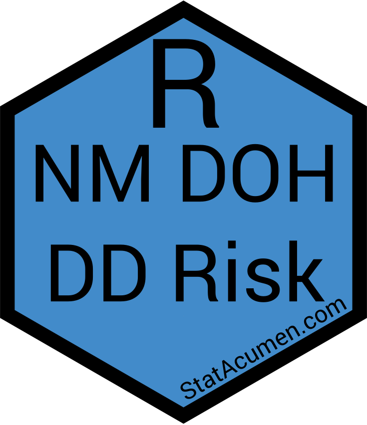

<!-- README.md is generated from README.Rmd. Please edit that file -->

```{r, include = FALSE}
knitr::opts_chunk$set(
  collapse = TRUE,
  comment = "#>",
  fig.path = "README-"
)
```

# nmdohddrisk <a href='https://github.com/erikerhardt/nmdohddrisk'></a>

<!-- badges: start -->
[](https://github.com/erikerhardt/nmdohddrisk/actions/workflows/check-standard.yaml)
<!-- badges: end -->

## Overview

Risk Prediction model for New Mexico (NM) Department of Health (DOH) Developmental Disabilities (DD) Abuse, Neglect, and Exploitation (ANE)

* <strong><a href="https://erikerhardt.github.io/nmdohddrisk/">Documentation and Vignettes</a></strong>
* <a href="https://github.com/erikerhardt/nmdohddrisk/issues">Report Bug or Request Feature</a>

## Installation

```{r, eval = FALSE}
# The development version from GitHub
# install.packages("devtools")
remotes::install_github("erikerhardt/nmdohddrisk")
```

## Usage

```{r example}
library(nmdohddrisk)
nmdohddrisk_logo()
?`nmdohddrisk-package`
```

